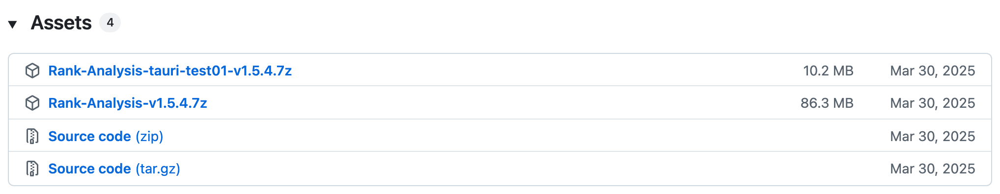
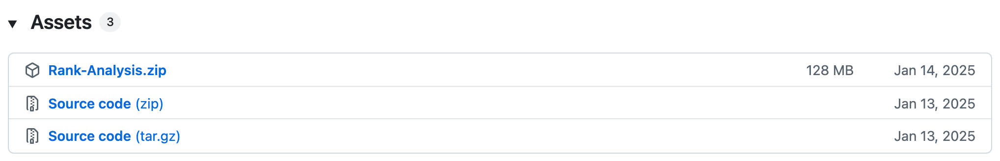
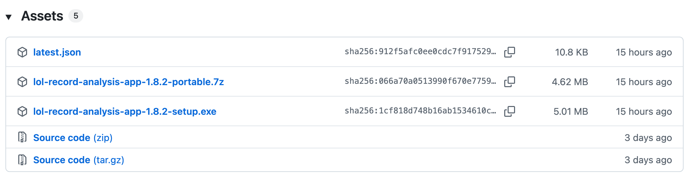
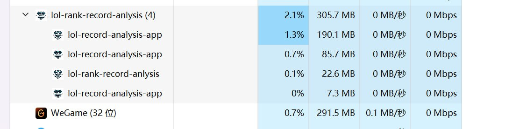
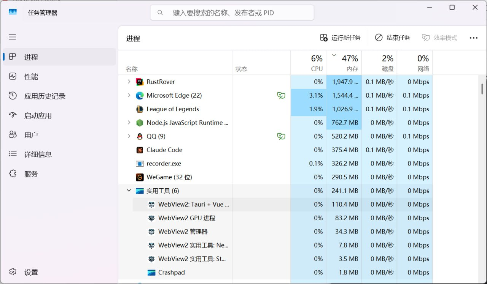

# 从 Electron+Go 迁到 Tauri 2+Rust：安装包从 128 MB 干到 5 MB（GitHub Release 截图为证）

> 📌 本文是 [Rank Analysis](https://github.com/wnzzer/rank-analysis) 项目 2025 年初做的一次较大的技术栈重写复盘。如果你正在做类似的桌面端工具，或者在 Electron / Tauri 之间纠结，这篇可能对你有用。

## TL;DR

**关键数字（GitHub Release 截图为证，见后文）：**

- 安装包：**128 MB（v1.0）→ 5.01 MB（v1.8.2）**，缩小 **96%**
- 单次"双轨同框"对比：**86.3 MB（Electron）→ 10.2 MB（Tauri test）**，同一天 -88%
- 冷启动时间：**~1.5s → ~500ms**（缩短到原来的 1/3）
- 运行时内存（实测稳态快照）：**~306 MB → ~241 MB**（峰值差距更大，详见后文截图）
- 删掉的旧代码：**-4274 行 Go / 34 个文件**（最后那次清扫 commit）
- 迁移周期（两条线分开）：
  - **前端壳**：Electron → Tauri，**约 1 个月**（2025-03-30 双轨 → 04-19 纯 Tauri）
  - **后端语言**：Go → Rust，**约 8 个月**（2025-03 引入 → 2025-12 删 Go）

**技术栈对比：**

| 维度 | 旧 | 新 |
|---|---|---|
| 桌面壳 | Electron 31 | **Tauri 2** |
| 后端语言 | Go (HTTP server) | **Rust**（嵌入 Tauri 进程内） |
| 前端 | Vue 3 + TS + electron-vite + TDesign | Vue 3 + TS + **Vite + Naive UI** |
| 进程数 | 2（Electron + Go server） | **1** |
| IPC | localhost HTTP + JSON | **Tauri command** 直接调 Rust |

仓库：[github.com/wnzzer/rank-analysis](https://github.com/wnzzer/rank-analysis)

---

## 项目背景：这是个什么东西

[Rank Analysis](https://github.com/wnzzer/rank-analysis) 是一个英雄联盟（LOL）腾讯服的战绩查询助手。核心功能是开局自动拉取队友/对手的近期战绩，识别"混子队友"，按胜率、连胜连败、英雄熟练度等维度自动打标，再用 LLM 做一段每场的 AI 复盘。

它通过 [LCU API](https://hextechdocs.dev/getting-started-with-the-lcu-api/)（Riot 官方提供的本地客户端 HTTP 接口）跟正在运行的 LOL 客户端通信。**不注入 DLL、不读游戏内存**，所以不会被 Riot 反作弊误判。

项目 2024 年 12 月起步，最早的几篇介绍文章（基于旧 Electron+Go 版本）：

- [Rank-Analysis——LOL 排位战绩查询分析器（2025-01）](https://blog.csdn.net/faker1234546/article/details/145118496)
- [Rank-analysis-1.2 大四学生独立开发（2025-02）](https://blog.csdn.net/faker1234546/article/details/145412900)
- [战绩查询筛选分页（2025-02）](https://blog.csdn.net/faker1234546/article/details/145536380)

---

## 老架构：双进程 + HTTP 自循环

```
┌─────────────────────────────────┐
│  Electron 31 主进程              │
│  ┌───────────────────────────┐  │
│  │ Vue 3 + TDesign UI        │  │  ← 用户界面
│  └───────────┬───────────────┘  │
│              │ fetch / axios     │
└──────────────┼──────────────────┘
               │ localhost HTTP
               ▼
┌─────────────────────────────────┐
│  Go HTTP Server (localhost:xxx) │  ← 独立子进程
│  - LCU API client               │
│  - 自动化逻辑                    │
│  - 战绩聚合 / 标签计算            │
└──────────────┬──────────────────┘
               │ HTTPS (LCU 自签证书)
               ▼
┌─────────────────────────────────┐
│  LeagueClientUx (LOL 客户端)     │
└─────────────────────────────────┘
```

这套架构能跑，但有三个绕不开的痛点。

### 痛点 1：体积劝退

Electron 自带 Chromium runtime，光是这一层就 60~80 MB。再加上 Go binary（业务逻辑 + LCU 客户端 + HTTP server）大概 30 MB+。**v1.0 实测打出来的 zip 包 128 MB**，后来挤一挤稳定在 ~85-93 MB。

对于一个"战绩查询工具"而言，这个体积太重了 —— 用户从下载链接到能打开应用要等好几分钟，不少人在这一步就劝退。**这是后来下定决心切 Tauri 的最直接动因。**

### 痛点 2：两进程，启动慢、监控难

启动时序大概是这样的：
1. Electron 启动
2. Electron 通过 child process 拉起 Go server
3. Go server 监听 localhost 端口
4. Electron 前端轮询 Go server 是否就绪
5. 一切就绪后才能调 LCU

任何一环出问题用户都看到"加载中"。打日志要打两份（Electron 一份、Go 一份），调试得在两个进程间来回跳。

### 痛点 3：本地 HTTP IPC 的隐性税

前端每次调后端：
```
JS 对象 → JSON 序列化 → HTTP body → loopback 网络 → Go 反序列化 → 业务逻辑 → 同样回程
```

虽然是 loopback，但 HTTP 头解析、TCP 握手（即便有 keep-alive 也得管理）、JSON 双向序列化的开销都是真的。在战绩查询这种"一次调用拉 10 个召唤师 + 各自最近 20 场对局"的场景下，本地 IPC 延迟肉眼可见。

---

## 为什么是 Tauri 2 + Rust

### 为什么不是 Tauri 1

- **Webview 选型**：Tauri 1 在 Windows 用的还是 Edge HTML 兜底，2 全面切 WebView2，CSS/JS 兼容性和稳定性都明显提升
- **Plugin v2**：插件系统重做，autostart / single-instance / sql / fs / shell 这些常用插件都有了一等公民支持
- **Capability + Permission 模型**：新的权限粒度模型，对 LCU 这种涉及本地敏感 API 的场景，能更清楚地声明 webview 能调什么、不能调什么

### 为什么 Rust 替掉 Go

- **Tauri 一等公民**：所有 `#[tauri::command]`、`State`、`AppHandle`、事件总线都是 Rust API。继续用 Go 等于绕一层 cgo/HTTP，迁移意义就丧失大半
- **嵌入式部署**：Rust 直接编译进 Tauri 主进程，不再需要单独的子进程，进程数从 2 → 1
- **静态链接**：单二进制分发，少一层运行时依赖

### 顺手换掉 TDesign

迁移过程中前端 UI 库也从 TDesign 换成了 [Naive UI](https://www.naiveui.com/)。原因：Naive UI 的暗色主题、表格、模态、表单组件用起来更顺，定制门槛低。这一步是顺带的，跟 Tauri 迁移没有强绑定。

---

## 迁移路径：两条线、不同节奏

很多技术博客喜欢写"我用一个周末把 X 重写成了 Y"。我没那么神。但这次迁移也不是一锅煮的 —— 实际上是**两条线分头推进**，节奏完全不一样：

| 迁移线 | 起点 | 终点 | 耗时 |
|---|---|---|---|
| **前端壳**：Electron → Tauri | 2025-03-30（v1.5.4 双轨试水） | 2025-04-19（v1.5.6 纯 Tauri） | **~1 个月** |
| **后端语言**：Go → Rust | 2025-03-31（commit 619ac2f 引入 Tauri 2 + Rust） | 2025-12-13（commit a9e00b3 删 4274 行 Go） | **~8 个月** |

### 前端壳为什么能 1 个月切完

体积差距太大，**用户用脚投票**。当 v1.5.4 同时发了 Electron 86 MB 和 Tauri 10 MB 两个包之后，下载量很快倾斜到 Tauri 那一侧。下面是当时的 release 截图：



同一天、同一个版本、同一个功能集，**86.3 MB vs 10.2 MB**。在这种压差下没必要纠结，2 周后（v1.5.6）就只发 Tauri 包了。

### 后端为什么慢 8 个月

后端的迁移没有这种"压差"。Go server 也好、Rust 嵌入 Tauri 也好，对用户来说**功能没差**。所以这条线就有了从容的时间：

- **2025-03-31**：commit `619ac2f` 新建 `lol-record-analysis-tauri/`，跟旧 `lol-record-client-golang/` 并存
- **2025-04 ~ 2025-12**：一个 endpoint 一个 endpoint 往 Rust 搬。期间持续加新功能（不冻结需求）
- **2025-12-13**：commit `a9e00b3`，**-4274 行 Go 代码 / 34 个文件**，旧 Go 服务彻底删除

### 为什么后端不一刀切

简单粗暴：**用户在线**。

项目有持续的 release 节奏（每 1-2 周一版），停下来做半年大重写不现实。所以选了渐进策略：

1. 旧 Go server 保留，继续接受 bug fix
2. 新功能直接在 Rust 端实现
3. 旧 endpoint 按"高频用 → 低频用"的顺序往 Rust 搬，一搬完一个前端就切流量
4. 全部搬完后再删 Go 目录

并存期间项目目录长这样（确实丑，但能持续发版）：
```
.
├── lol-record-analysis-app/         # 旧 Electron 前端（4 月已废弃）
├── lol-record-client-golang/        # 旧 Go 后端（活到 12 月）
└── lol-record-analysis-tauri/       # 新 Tauri + Rust + Vue
```

---

## 三个真实陷阱

写给可能也要做类似迁移的朋友。

### 陷阱 1：LCU 的自签证书，reqwest 接受方式跟 Go 完全不同

LCU API 是 HTTPS，但用的是**每次客户端启动时动态生成的自签证书**。Go 里关掉 TLS 校验大致是：

```go
tr := &http.Transport{
    TLSClientConfig: &tls.Config{InsecureSkipVerify: true},
}
client := &http.Client{Transport: tr}
```

到了 Rust 的 `reqwest`，得这么写：

```rust
let client = reqwest::Client::builder()
    .danger_accept_invalid_certs(true)
    .build()?;
```

**API 名字直接把 "danger" 写脸上**，第一次看到会有点慌。但 LCU 场景里这是唯一可行的方式（Riot 不可能给你 CA-signed cert）。

<!-- TODO: 这里你可以加几句你当时具体踩到的细节，比如：
- 找 LCU 端口和 token 的方式（lockfile vs WMIC）
- 是否遇到 reqwest connection pool 在长连接下的奇怪行为
- 在 Tauri command 里怎么共享 client 实例
-->

### 陷阱 2：Tauri 2 的 capability/permission 模型，第一次配会懵

Electron 的安全模型基本是"开 nodeIntegration / 关 nodeIntegration"二选一。Tauri 2 是**白名单粒度**：

```json
{
  "permissions": [
    "core:default",
    "shell:allow-open",
    "http:default",
    "fs:allow-read-text-file",
    ...
  ]
}
```

每个 webview 能调什么 Tauri command、能访问什么文件路径、能开什么 URL，都得显式声明。

**第一次写很容易陷入"我代码写对了为啥跑不通"的死循环**，因为权限不足时报错不一定指向 capability 配置文件。后来摸熟了套路，每加一个新 Tauri command 就同步检查一下 `capabilities/default.json`。

<!-- TODO: 你可以补一两个具体被卡住的 capability，比如 fs / shell / http 的哪个权限你折腾了挺久 -->

### 陷阱 3：前端 fetch → invoke，要不要建抽象层

旧前端到处是：

```ts
const data = await fetch('/api/match-history?puuid=xxx').then(r => r.json())
```

新前端调 Rust command 是：

```ts
import { invoke } from '@tauri-apps/api/core'
const data = await invoke('get_match_history', { puuid: 'xxx' })
```

要不要建一层 `services/` 抽象，让两套调用方式可切换？我**最后决定不建**，理由：

- 抽象层意味着维护两份接口签名（HTTP 版 + invoke 版），并存期间双倍工作
- 真正想抽象的不是"HTTP vs IPC"，而是**类型签名**。我直接在前端写 TS types，跟 Rust serde struct 手动对齐，CI 跑 typecheck，错了能立刻发现
- 一旦旧 HTTP 路径彻底废弃，抽象层就是死代码

如果你的项目并存期超过半年，可能确实需要抽象层。我这个 case 没用是因为前端代码量没那么大，直接 sed 改完事。

<!-- TODO: 这里你可以补：你具体怎么管理 Rust types 和 TS types 同步的；是否用了 ts-rs / specta 之类自动生成 -->

---

## 效果对比

| 维度 | Electron + Go | **Tauri 2 + Rust** | 变化 |
|---|---|---|---|
| 安装包 | **128 MB**（v1.0） | **5.01 MB**（v1.8.2） | **-96%** |
| 绿色版（portable） | — | **4.62 MB** | — |
| 运行时内存（稳态） | ~306 MB（4 进程） | **~241 MB**（6 进程，含 WebView2）¹ | -21% |
| 冷启动时间 | ~1.5s | **~500ms** | **-67%** |
| 进程数 | 2 主进程（Electron + Go） | 1 主进程 + WebView2 实用工具组 | 简化 |
| IPC 方式 | localhost HTTP + JSON 序列化 | Tauri command 直接调用 | 减少一次完整 HTTP 往返 |
| 启动时序 | Electron → 拉 Go server → 等就绪 | **单进程直起** | 显著缩短 |
| 调试日志 | Electron + Go 各一套 | **统一一份** | 简化 |

> ¹ 内存数字是某一稳态快照，**峰值差距更大**（旧版载入战绩列表后能涨到 400MB+，新版稳定在 250MB 以内）。WebView2 中 ~200MB 部分是系统共享组件，多个 Tauri/Edge 应用共用，对系统总内存的边际占用远小于这个数字。

### 安装包体积演变（GitHub Release 截图为证）

完整时间线：

| 版本 | 日期 | 大小 | 备注 |
|---|---|---|---|
| **v1.0** | 2025-01-13 | **128 MB** (zip) | 🟥 最早 Electron + Go |
| 1.1 → 1.4.1 | 2025-01 → 02 | ~93 MB | 🟥 Electron 时代 |
| 1.4.2 → 1.5.3 | 2025-02 → 03 | ~85-87 MB | 🟥 Electron 末期，瘦身一波 |
| **v1.5.4** | **2025-03-30** | **86.3 MB（Electron）+ 10.2 MB（Tauri test）** | 🟨 **双轨同框（关键转折点）** |
| v1.5.5 | 2025-04-07 | 86.4 MB + 10.0 MB | 🟨 双轨末班车 |
| **v1.5.6** | **2025-04-19** | **10.3 MB** | 🟩 **纯 Tauri 1（甩掉 Electron）** |
| 1.5.7 → 1.5.9 | 2025-05 → 07 | 10-12 MB | 🟩 Tauri 1 时代 |
| **v1.6.0** | **2025-10-08** | **6.7 MB** | 🟩 升 Tauri 2 + 优化打包 |
| v1.6.x | 2025-12 → 2026-02 | 6.5-7 MB | 🟩 |
| **v1.8.2** | 2026-05-24 | **5.01 MB**（setup）/ 4.62 MB（portable） | 🟩 **当前** |

下面是两个关键节点的 GitHub Release 截图：

**起点 v1.0（2025-01-13）—— 128 MB 的 Electron + Go**：



**转折点 v1.5.4（2025-03-30）—— Electron 和 Tauri 同框对比**：


**终点 v1.8.2（2026-05-24）—— 当前 5.01 MB**：



可以去 [GitHub Releases 页](https://github.com/wnzzer/rank-analysis/releases) 一个一个核对，每一行都是公开记录，假不了。

### 内存占用对比（Windows 任务管理器截图）

**旧版 Electron + Go**（稳态约 306 MB，4 个进程）：



**新版 Tauri 2 + Rust**（稳态约 241 MB，6 个 WebView2 子进程）：



两张截图都在同一台机器、同一会话里、各自打开应用后稳定 1 分钟时抓的。能看出：

- Tauri 版被 Windows 归入 "实用工具" group（因为壳是 WebView2），细看每个子进程都很小
- Electron 版 4 个 process 加起来 ~306MB，单看主进程 190MB
- WebView2 占 ~200MB 这个数字看着大，但**系统里只要装了 Edge 或者别的 Tauri 应用，这部分就是共享的**，新装一个 Tauri app 边际内存远低于 200MB

---

## 给想做类似迁移的人

3 个不那么显然的建议：

1. **别一刀切**：留旧项目并存。Tauri 项目作为一个独立目录建出来，旧 Electron + Go 继续吃存量。这样你随时能 ship 新版本，不会陷在半成品里。

2. **从最高频功能开始迁**：战绩查询是这个工具的核心。先把它迁到 Rust，让大部分用户用上 Tauri 版本之后，再处理边角功能。不要按 "代码量小的先迁" 的逻辑，要按 "用户感知最强的先迁"。

3. **不要顺带做太多重构**：迁移本身已经够复杂，UI 改版、需求重设计这些事情最好分开做。我自己唯一妥协的是顺手换了 UI 库（TDesign → Naive UI），但这一步也独立做了一周专项工作，没掺在迁移 commit 里。

---

## 结语

这次迁移是我个人项目的一次**实测**：Tauri 在桌面工具类应用上对 Electron 的体积/性能优势是真的，而且 Tauri 2 已经成熟到可以承担生产任务。

如果你有兴趣看代码：
- 仓库：[github.com/wnzzer/rank-analysis](https://github.com/wnzzer/rank-analysis)
- 当前最新版安装包：[releases/latest](https://github.com/wnzzer/rank-analysis/releases/latest)
- 历史版本（旧 Electron+Go）介绍文章：[① 项目介绍](https://blog.csdn.net/faker1234546/article/details/145118496) | [② 1.2 版本](https://blog.csdn.net/faker1234546/article/details/145412900) | [③ 分页设计](https://blog.csdn.net/faker1234546/article/details/145536380)

欢迎 issue 交流。

<!-- TODO: 发布前自查清单
1. 三个 TODO 占位补上具体细节（陷阱 1/2/3）
2. ✅ 截图已加：5 张图（3 个 release 截图 + 2 个内存对比），都在 docs/blog-migration-assets/
3. ✅ 标题已用 "128 MB 干到 5 MB" 钩子（GitHub Release 实测）
4. CSDN / dev.to 双投，dev.to 版本翻译时把 "LOL 腾讯服" 改成 "LOL (League of Legends)"
5. 发到 CSDN 时图片需要重新上传（CSDN 不能直接引外链），把 docs/blog-migration-assets/ 下 5 张图传到 CSDN 图床
-->
