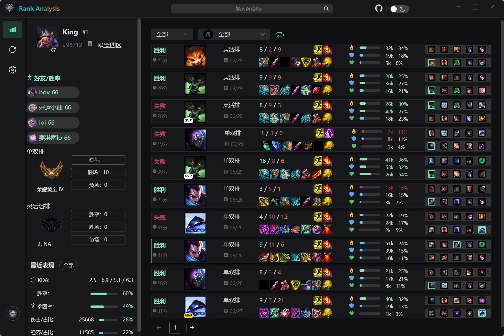
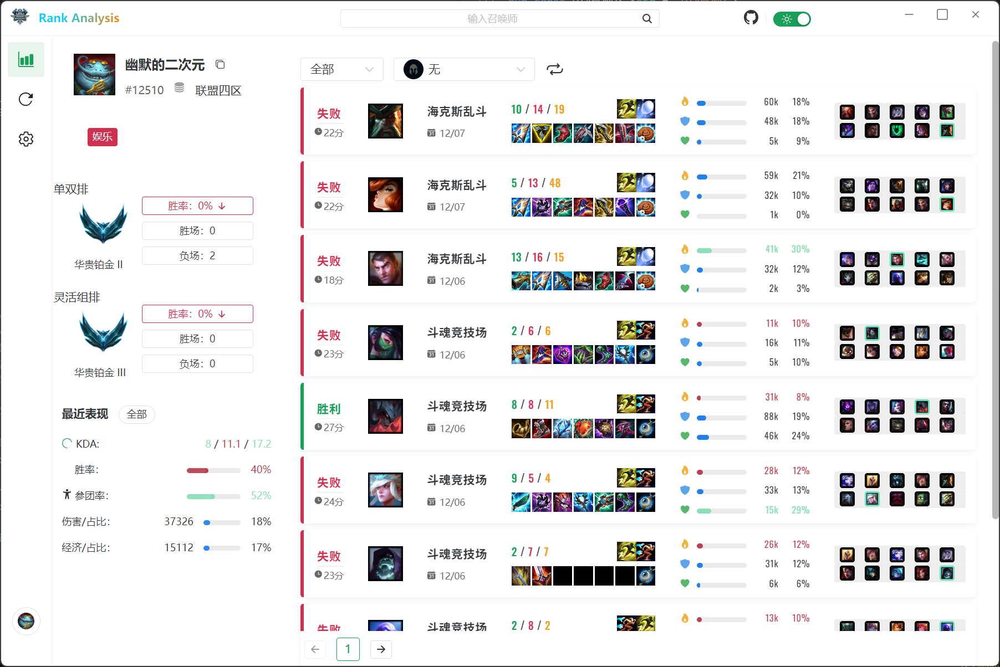
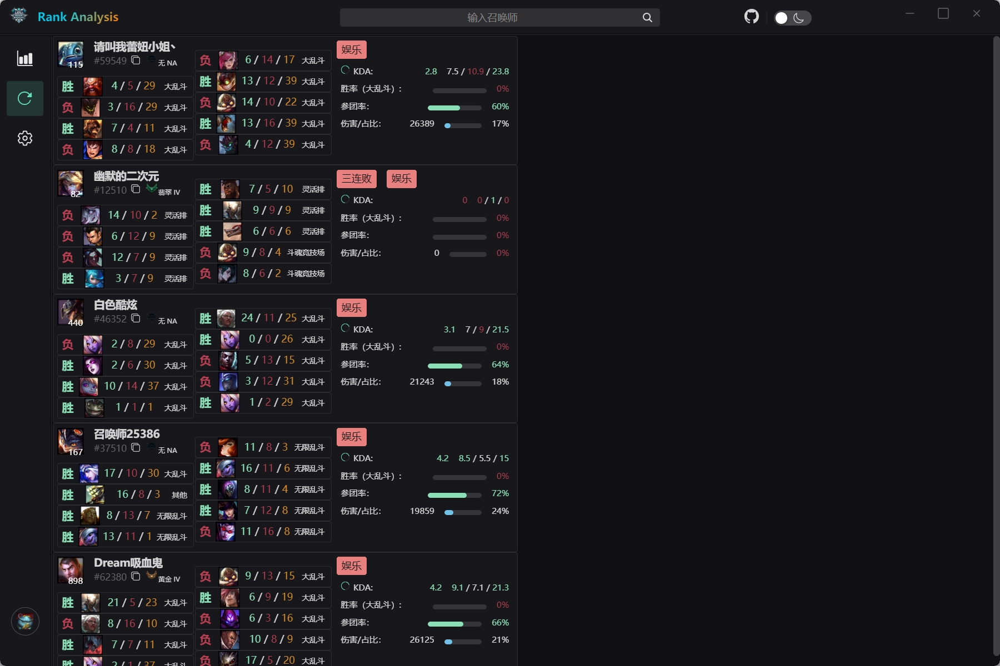
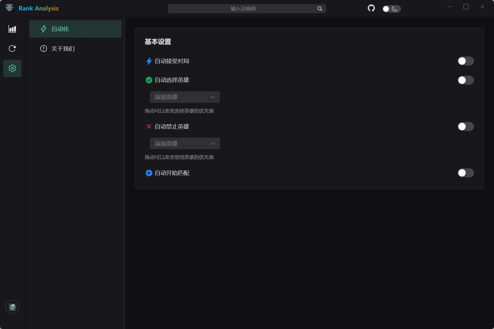
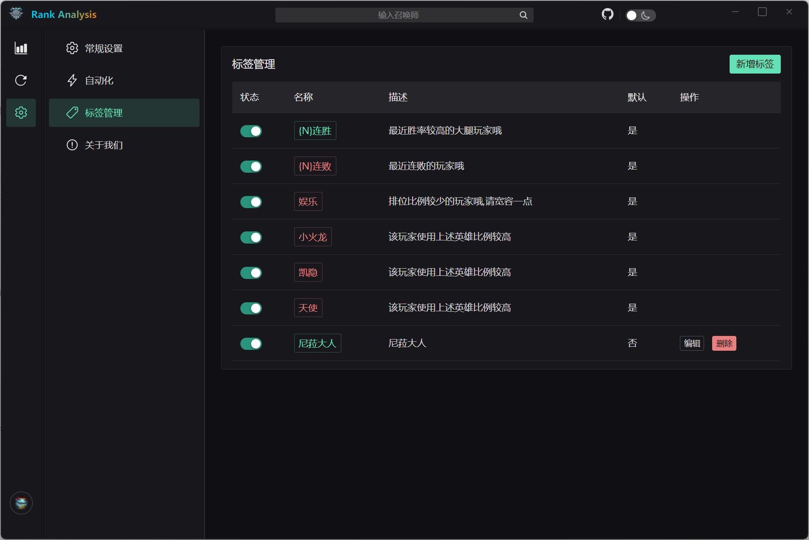

<div align="center">
  
  <h1>Rank Analysis</h1>
  <p>基于 LCU API 的英雄联盟排位分析工具</p>

  <!-- Badges -->
  <p>
    <a href="https://tauri.app/">
      
    </a>
    <a href="https://www.rust-lang.org/">
      
    </a>
    <a href="https://vuejs.org/">
      
    </a>
    <a href="https://www.typescriptlang.org/">
      
    </a>
    
    <a href="./LICENSE">
      
    </a>
  </p>

  <!-- Stats -->
  <p>
    <a href="https://github.com/wnzzer/lol-rank-record-analysis/releases">
      
    </a>
    <a href="https://github.com/wnzzer/lol-rank-record-analysis/releases">
      
    </a>
    <a href="https://github.com/wnzzer/lol-rank-record-analysis/stargazers">
      
    </a>
  </p>
</div>

---

## 📖 简介

**Rank Analysis** 是一个基于 Riot 提供的 LCU API 开发的英雄联盟排位数据分析工具。致力于帮助玩家轻松查询战绩并进行深度对局分析。本项目使用 **Tauri 2.0** 构建，结合 Rust 的高性能与 Web 前端的灵活性，打造最精简、性能最好的战绩查询体验。

## ✨ 功能特点

### 📊 战绩查询
- **高低胜率高亮**：直观展示队友近期表现。
- **MVP 显示**：快速识别大腿玩家。
- **玩家标签**：自动标记连胜、连败、非排位玩家。
- **关系显示**：识别宿敌与好友。

### 🔍 对局分析
- **预组队检测**：标记预先组队的玩家（开黑检测）。
- **历史遭遇**：标记曾经遇见过的玩家。

### 🤖 自动化辅助
- **自动匹配**：自动开始寻找对局。
- **自动接受**：匹配成功后自动接受。
- **自动 BP**：自动选择和禁用预设英雄。

## 📸 软件预览

<div align="center">
  
  
</div>
<div align="center">
  
  
</div>
<div align="center">
  
</div>

## 🚀 使用方法

1. **下载**：
   - 前往 [Release 页面](https://github.com/wnzzer/lol-rank-record-analysis/releases) 下载最新的构建版本压缩包。
   - 使用 UpgradeLink分发平台提供的 [CDN下载地址](https://download.upgrade.toolsetlink.com/download?appKey=rX76p0GShXom2yNnlsSDYw)下载 （感谢 UpgradeLink分发平台提供支持） 
     

   > **系统要求**: Windows 10 1803 及以上版本（需支持 WebView2）。


2. **运行**：解压后直接运行可执行文件，无需管理员权限。

3. **连接**：软件运行时会自动检测游戏客户端。
   > **注意**: 
   > - 当前仅支持腾讯服务器。
   > - 支持在游戏启动后中途打开软件，会自动连接。

## 🛠️ 开发与构建

如果你想自己编译本项目，请按照以下步骤操作：

### 环境准备
- [Node.js](https://nodejs.org/) (推荐 LTS 版本)
- [Rust](https://www.rust-lang.org/)
- C++ 构建环境 (Visual Studio C++ Build Tools)

### 构建步骤

1. 克隆项目并进入 Tauri 目录：
   ```bash
   cd lol-record-analysis-tauri
   ```

2. 安装依赖：
   ```bash
   npm install
   ```

3. 运行开发模式：
   ```bash
   npm run tauri dev
   ```

4. 编译生产版本：
   ```bash
   npm run tauri build
   ```
   构建完成后，可执行文件位于 `src-tauri/target/release/bundle` 目录下。

## 📊 代码质量

本项目采用现代化的开发工具链，确保代码质量和一致性：

### 质量工具
- **ESLint**: 静态代码分析
- **Prettier**: 代码格式化
- **TypeScript**: 严格类型检查
- **Clippy**: Rust 代码 Lint
- **Rustfmt**: Rust 代码格式化
- **GitHub Actions**: 自动化 CI/CD

### 质量检查命令

```bash
# 前端代码检查
cd lol-record-analysis-tauri
npm run lint          # ESLint 检查
npm run format        # Prettier 格式化
npm run typecheck     # TypeScript 类型检查

# 后端代码检查 (需要 Windows 环境)
cd src-tauri
cargo fmt             # 格式化
cargo clippy          # Lint 检查
```

详细的代码质量标准和贡献指南，请参阅：
- [代码质量标准](./CODE_QUALITY.md)
- [贡献指南](./CONTRIBUTING.md)

## 🤝 参与贡献

欢迎提交 Issue 和 Pull Request！

- **反馈问题**: 通过 [GitHub Issues](https://github.com/wnzzer/lol-rank-record-analysis/issues) 提交。
- **提交代码**: 欢迎改进代码或增加新功能。

## 📄 开源协议

本项目基于 [MIT License](./LICENSE) 开源。

## Star 趋势

[](https://star-history.com/#wnzzer/lol-rank-record-analysis&Date)
