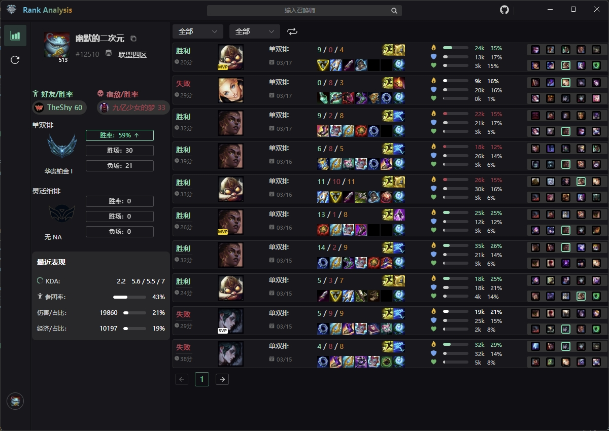
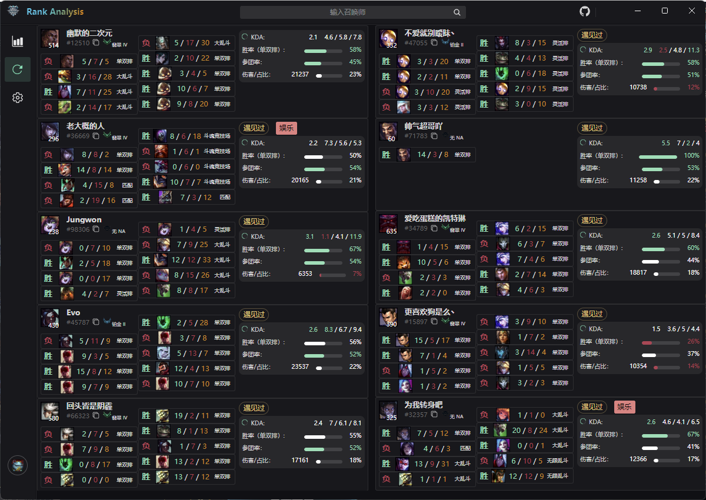

<div align="center">
  <div>
    
  </div>
  <h1>基于 LCU API 的英雄联盟排位分析工具</h1>
</div>

<p align="center">
    <a href="https://github.com/wnzzer/lol-rank-record-analysis/releases"></a>
    <a href="https://github.com/wnzzer/lol-rank-record-analysis/releases"></a>
    <a href="https://github.com/wnzzer/lol-rank-record-analysis/stargazers"></a>
</p>

---

# 简介

**Rank Analysis** 是一个基于 Riot 提供的 LCU API 的英雄联盟排位数据分析工具，致力于帮助玩家轻松查询战绩并进行深度对局分析。

---

# 功能特点

## 已支持功能

### 战绩查询

1. 高低胜率高亮显示
2. Mvp 显示
3. 打标签：对连胜、连败、非排位玩家进行标记 

### 对局分析

1. 预先组队标记
2. 遇见过的玩家标记

---

# 使用方法

1. 前往 [Release 页面](https://github.com/wnzzer/lol-rank-record-analysis/releases) 下载最新的构建版本压缩包。
2. 解压后直接运行，无需管理员权限。
3. 软件运行时会自动检测游戏客户端，无需考虑启动顺序，支持中途启动并保持稳定连接。

> **注意**
>
> - 当前仅支持腾讯服务器。
> - 若游戏客户端正在运行，软件会自动连接并获取相关数据。

---

# 软件预览





---

# 安装与开发

## 编译与构建

以下是通过源码构建 **Rank Analysis** 的步骤。


### 1. 一键编译
>rank-analysis 内置了一键编译脚本，可以一键编译并生成 Windows 版本。

1. 切换到前端项目的根目录 `./lol-record-analysis-app`。

2. 运行一键编译脚本： `npm run build:win`

3. 打开 `./lol-record-analysis-app/dist/win-unpacked` 目录，即可看到生成的 Windows 版本。

## 2. 分别编译

### Electron 前端

1. 切换到 Electron 主程序目录：
   ```bash
   cd ./lol-record-analysis-app
   ```
2. 安装依赖：
   ```bash
   npm install
   ```
3. 开发模式运行：
   ```bash
   npm run dev
   ```
4. 构建 Windows 版本：
   ```bash
   npm run build:win
   ```

### Golang 后端

1. 切换到 Golang 主程序目录：
   ```bash
   cd ./lol-record-client-golang
   ```
2. 编译为二进制版本：
   ```bash
   go build
   ```
3. 将生成的 `lol-record-analysis.exe` 复制到以下路径：
   ```
   ./lol-record-analysis-app/dist/win-unpacked/resources/backend/
   ```

## 提供反馈

- 通过 [GitHub Issues](https://github.com/wnzzer/lol-rank-record-analysis/issues) 提交问题或建议。
- 请尽可能详细地描述问题或需求，以便开发者快速定位和解决问题。

## 提交代码

- Fork 项目并创建新分支。
- 添加您实现的功能或修复的 Bug。
- 提交 Pull Request 并附上详细描述。

---

# 致谢与免责声明

## 致谢

**Rank Analysis** 的开发参考了以下优秀的开源项目，在此对这些项目的贡献者表示衷心感谢：

| 项目名称                                                                                                   | 描述             |
| ------------------------------------------------------------------------------------------------------ | -------------- |
| ⭐⭐⭐ [LeagueAkari](https://github.com/Hanxven/LeagueAkari)                                              | 游戏风格与设计思路参考    |
| ⭐⭐⭐ [League of Legends LCU and Riot Client API Docs](https://github.com/KebsCS/lcu-and-riotclient-api) | LCU API 文档参考   |
| ⭐⭐ [Seraphine](https://github.com/Zzaphkiel/Seraphine)                                                 | 集成思路参考         |
| ⭐ [LCU API](https://www.mingweisamuel.com/lcu-schema/tool/#/)                                          | LCU API 早期文档参考 |

## 免责声明

本软件作为基于 Riot 提供的 League Client Update (LCU) API 开发的辅助工具，由于其设计和实施均未采用侵入性技术手段，理论上不会直接干预或修改游戏数据。

然而需明确指出：

1. 未来腾讯可能更新反作弊系统或其他保护服务，可能会对本软件的使用产生兼容性问题。
2. 使用本软件可能带来包括但不限于游戏账户封禁、数据损坏或其他负面后果。

使用本软件的用户需自行承担由此产生的所有风险与后果。开发者对可能的损失不承担任何责任。

> **提示：**
> 请遵守相关游戏规则，维护健康公平的游戏环境。

---

