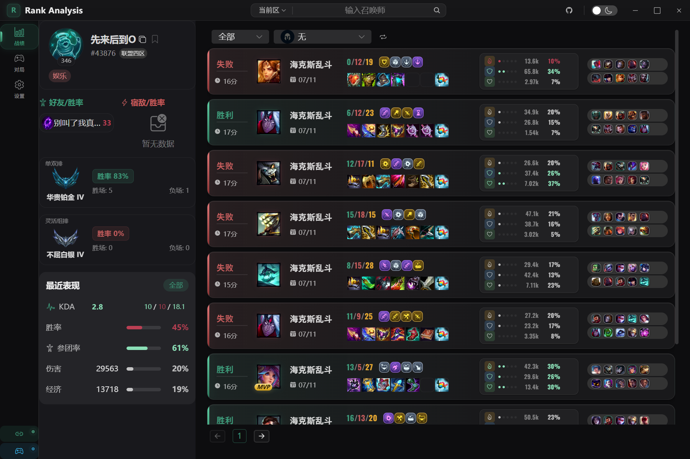
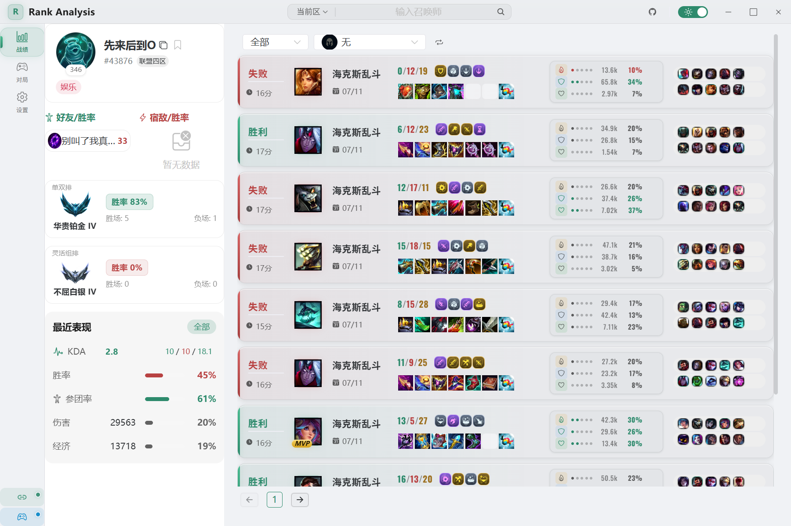
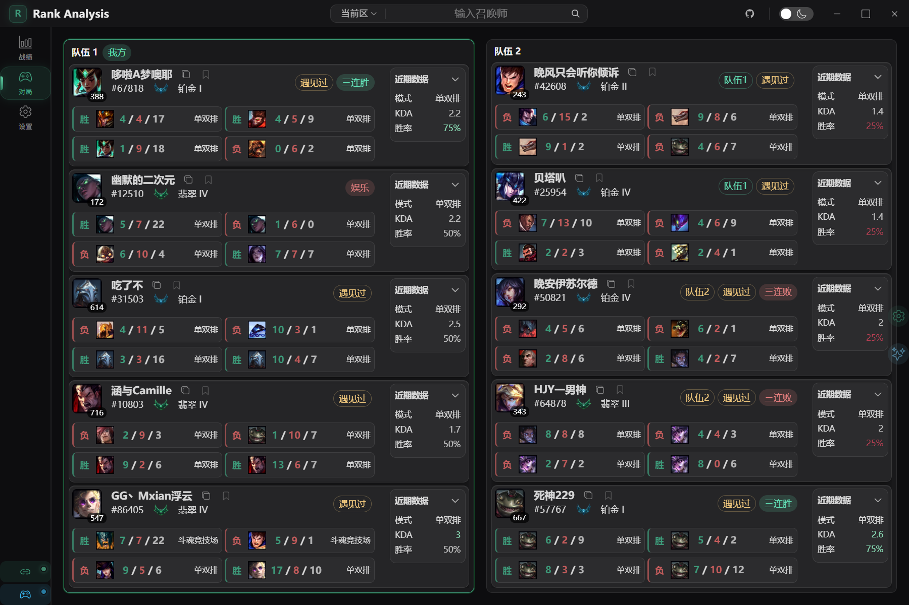
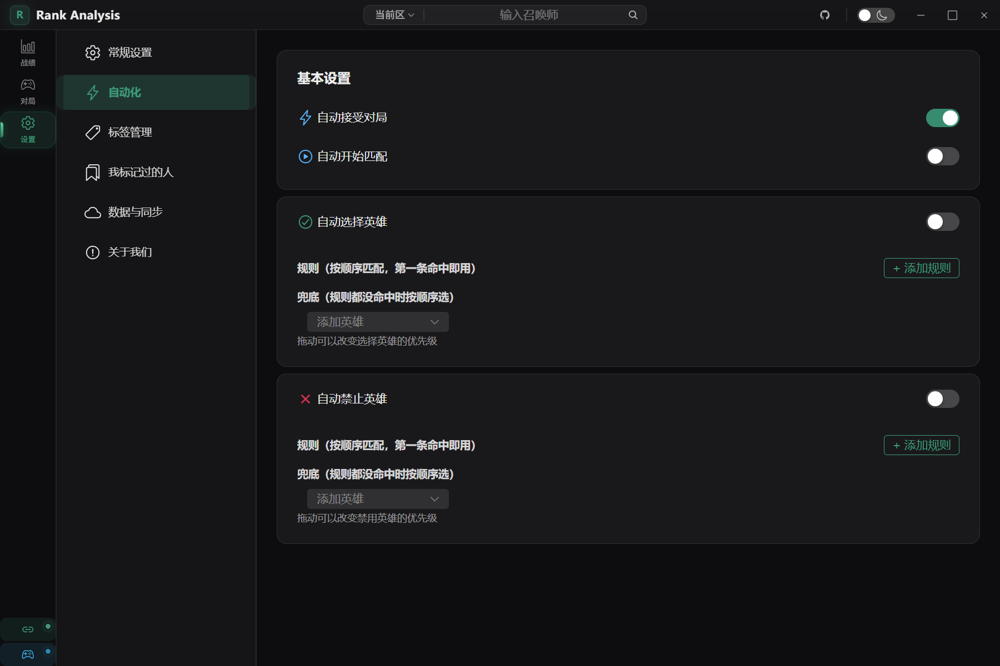
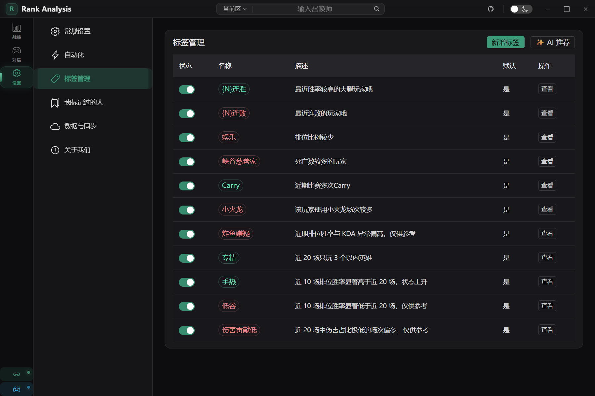
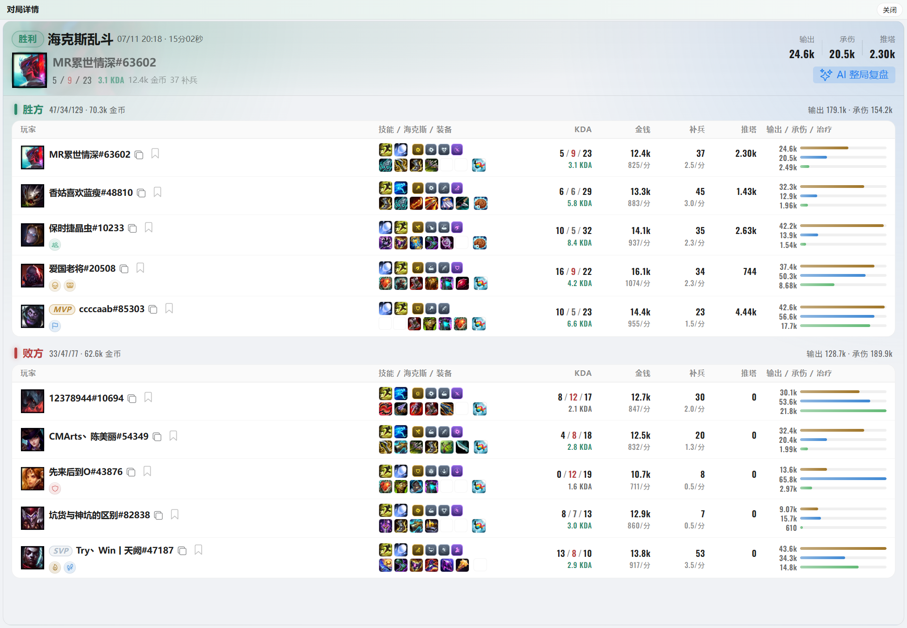

<div align="center">
  
  <h1>Rank Analysis</h1>
  <p>🎮 League of Legends Ranked Match Analysis Tool based on LCU API</p>

  <!-- Badges -->
  <p>
    <a href="https://tauri.app/">
      
    </a>
    <a href="https://www.rust-lang.org/">
      
    </a>
    <a href="https://vuejs.org/">
      
    </a>
    <a href="https://www.typescriptlang.org/">
      
    </a>
    
    <a href="./LICENSE">
      
    </a>
  </p>

  <!-- Stats -->
  <p>
    <a href="https://github.com/wnzzer/lol-rank-record-analysis/releases">
      
    </a>
    <a href="https://github.com/wnzzer/lol-rank-record-analysis/releases">
      
    </a>
    <a href="https://github.com/wnzzer/lol-rank-record-analysis/stargazers">
      
    </a>
  </p>

  <p>
    <a href="./README.zh-CN.md">中文</a> | <strong>English</strong>
  </p>
</div>

---

> **TL;DR for developers** — A native LoL client tool built with **Tauri 2 + Rust + Vue 3 + TypeScript**. **~5 MB installer**, single Windows binary, zero Electron overhead. Talks to the LCU WebSocket for live in-game state, async Rust HTTP for match history, on-device AI tagging pipeline on top. No DLL injection, no game memory access — uses only Riot's official local client API.

## 📖 Introduction

**Rank Analysis** is a League of Legends ranked match data analysis tool developed based on Riot's LCU API. It helps players easily query match history, identify teammate risks, and provides AI-powered intuitive match analysis. This project is built with **Tauri 2.0**, combining Rust's high performance with the flexibility of web frontends to deliver the most lightweight and efficient match query experience.

## ✨ Features

### 📊 Match History Query
- **Win Rate Highlighting**: Intuitively displays teammates' recent performance
- **MVP Display**: Quickly identify carry players
- **Player Tags**: Auto-tags win streaks, loss streaks, and non-ranked players
- **Relationship Display**: Identifies nemeses and friends

### 🔍 Match Analysis
- **Premade Detection**: Marks pre-grouped players (duo/squad detection)
- **Match History**: Marks previously encountered players
- **Match Details Panel**: Independent window showing 10 players' KDA, economy, CS, damage taken, towers destroyed, items, skills, and runes/augments
- **Augment Recognition**: Special queues like Arena automatically switch to augment display with rarity differentiation

### 🤖 AI Analysis
- **Lobby-level AI Assessment**: During lobby/queue phase, quickly assess teammate and opponent risks based on recent match history, favorite champions, role distribution, and tag information
- **Full Match AI Review**: One-click generation of complete match outcome analysis in match details, identifying who performed best, who fed, who got stomped, and who was dragged down by teammates
- **Single Player AI Review**: Supports individual analysis for any participant, determining if they performed well, poorly, got stomped, were dragged down, or played normally
- **Data Evidence-Driven**: AI conclusions are generated based on KDA, damage share, tank share, gold, kill participation, towers, and CS - not pure subjective commentary
- **Result Caching**: Same-match AI analysis results are cached locally within the session to reduce repeated request wait times

### 🤖 Automation Assistant
- **Auto Matchmaking**: Automatically starts searching for matches
- **Auto Accept**: Automatically accepts matches when found
- **Auto Pick/Ban**: Automatically selects and bans preset champions

## 📸 Screenshots

<div align="center">
  
  
</div>
<div align="center">
  
  
</div>
<div align="center">
  
</div>
<div align="center">
  
</div>

## 🚀 Usage

1. **Download**:
   - Download the latest build from the [Release Page](https://github.com/wnzzer/lol-rank-record-analysis/releases)
   - Or download via [UpgradeLink CDN](https://download.upgrade.toolsetlink.com/download?appKey=rX76p0GShXom2yNnlsSDYw) (Thanks to UpgradeLink for the support)
     

   > **System Requirements**: Windows 10 1803 or higher (WebView2 support required)

2. **Run**: Extract and run the executable directly - no admin privileges required

3. **Connect**: The software automatically detects the game client when running
   > **Notes**:
   > - Currently only supports Tencent servers (China)
   > - Can be opened mid-game and will auto-connect
   > - AI analysis requires internet access to call model services; network unavailability only affects AI features, not basic match history queries

## 🛠️ Development & Build

If you want to compile this project yourself, follow these steps:

### Prerequisites
- [Node.js](https://nodejs.org/) (LTS version recommended)
- [Rust](https://www.rust-lang.org/)
- C++ Build Environment (Visual Studio C++ Build Tools)

### Build Steps

1. Clone and enter the Tauri directory:
   ```bash
   cd lol-record-analysis-tauri
   ```

2. Install dependencies:
   ```bash
   npm install
   ```

3. Run in development mode:
   ```bash
   npm run tauri dev
   ```

4. Build production version:
   ```bash
   npm run tauri build
   ```
   The executable will be located in `src-tauri/target/release/bundle`

## 📊 Code Quality

This project uses modern development toolchain to ensure code quality and consistency:

### Quality Tools
- **ESLint**: Static code analysis
- **Prettier**: Code formatting
- **TypeScript**: Strict type checking
- **Clippy**: Rust code linting
- **Rustfmt**: Rust code formatting
- **GitHub Actions**: Automated CI/CD

### Quality Check Commands

```bash
cd lol-record-analysis-tauri

# One-shot gate — runs before every commit (mirrors CI exactly)
npm run check         # format + lint + typecheck + cargo fmt --check + clippy --all-targets --all-features -Dwarnings
npm run test          # vitest

# Individual steps (if you want to run them piecemeal)
npm run lint          # ESLint
npm run format        # Prettier
npm run typecheck     # vue-tsc
cd src-tauri && cargo fmt --all -- --check && cargo clippy --all-targets --all-features -- -Dwarnings
```

> `npm run check` is the canonical pre-commit gate. It matches the flags used by `.github/workflows/quality-checks.yml` — if it passes locally, CI will pass.

For detailed code quality standards and contribution guidelines, please refer to:
- [Code Quality Standards](./CODE_QUALITY.md)
- [Contributing Guide](./CONTRIBUTING.md)

## 🤝 Contributing

Issues and Pull Requests are welcome!

- **Bug Reports**: Submit via [GitHub Issues](https://github.com/wnzzer/lol-rank-record-analysis/issues)
- **Code Contributions**: Improvements and new features are welcome

## 📄 License

This project is open-sourced under the [MIT License](./LICENSE).

> Maintained with AI assistance experiments (Claude / LLM tooling)

## Star History

[](https://star-history.com/#wnzzer/lol-rank-record-analysis&Date)
